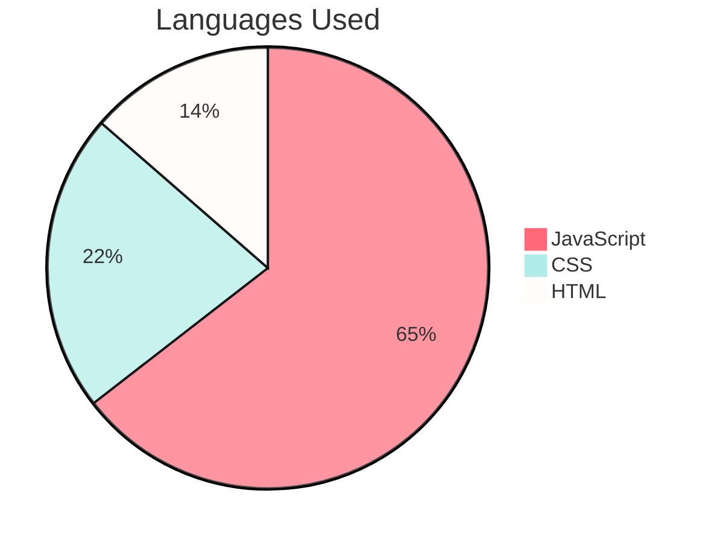

# CodeYourFuture Chat Service 

This application provide Chat Service to users to exchange messages on a single purpose build platform.

## Deployed Website

Access the deployed version of the application: <a href="lorena-chat-react.netlify.app/">lorena-chat-react.netlify.app</a>

## Inside The App


## Features

- [x] The app facilitates the user to write a meesage after inserting his/her name.
- [x] The app enables user to exchange messages in real-time with other users.
- [x] The app ensures user to delete a message.
- [x] The app provides the option to edit a message.


## Technologies Used:

- [x] JavaScript Frameworks: React
- [x] Node.js
- [x] CSS, HTML


## Pie Chart Of Languages Used



## Installation

**Clone the repository:**

```bash
git clone github.com/LorenaCapraru/cyf-chat-react
```

**Install dependencies:**

```bash
npm install
```

**Start the development server:**

```bash
npm start
```
